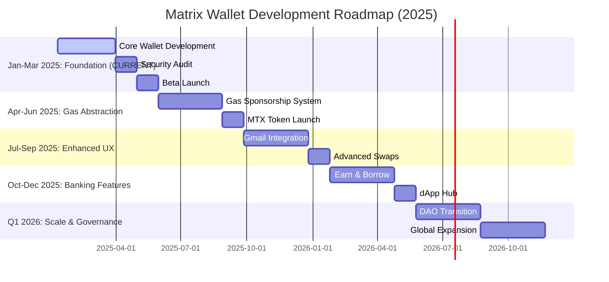
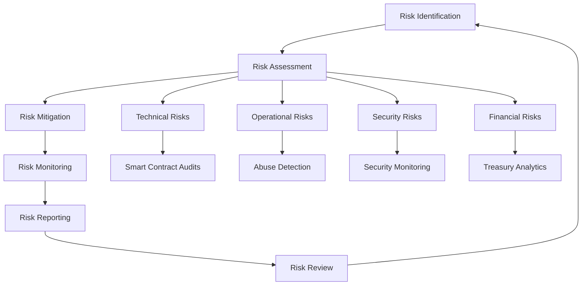

# Matrix Wallet Whitepaper

Version: 0.1 (Draft)
Last updated: 2025-10-20

## Executive Summary

Matrix Wallet is a non-custodial, EOA-based Web3 wallet designed to deliver a bank-like experience for everyone. It removes onboarding and gas frictions through OAuth sign-in, seedless recovery, gas-sponsored transfers, Gmail-based sending, and a curated dApp hub. Our goal is mass adoption with a grandparent-simple UX across major networks (Bitcoin, Ethereum, BNB Chain, Solana, Tron) and support for top assets. The MTX token underpins operations, gas sponsorship, and governance, with a fixed 13M supply and transparent unlock/refreeze policy.

Key highlights
- Non-custodial, EOA-first: maximum compatibility with chains and dApps from day one.
- Seedless onboarding: Sign in with Google/Apple; encrypted cloud backup; biometrics optional.
- Gas abstraction: policy-based sponsorship so users can send without juggling native gas.
- Human-first payments: send to a Gmail identity; QR/NFC for in-person transfers.
- Bank-like feature set: send, swap, earn, borrow, with safety rails and clear disclosures.
- 24/7 operations: priority support for MTX stakers; public status and incident reports.

## Problem and Opportunity

- Seed phrases, native gas fees, and complex UX block mainstream users.
- Onboarding is cumbersome; getting to a first successful transfer often requires buying native tokens.
- Existing wallets don’t feel like a “decentralized bank” (send, swap, earn, borrow) in one safe, simple app.

Personas and target users
- Everyday users 18+ seeking simple payments and savings in stablecoins.
- Remittance users needing low-cost, fast cross-border transfers.
- Web3-curious users who won’t manage seed phrases or native gas.
- Small merchants and freelancers accepting crypto without complex setup.

## Solution Overview

- EOA wallet for maximum chain/dApp compatibility at launch; delivers modern features without smart account fragmentation.
- One‑tap onboarding via Google/Apple OAuth; seedless UX with secure device binding and encrypted cloud backup.
- Gas‑sponsored transfers: policy‑based sponsorship to minimize or replace native gas for users.
- Send via Gmail: email handle resolution for easy payments; limits and fraud controls included.
- Banking‑like features: send/receive, swaps, earn, and borrow with clear disclosures and safety rails.
- Multi‑chain: Bitcoin, Ethereum, BNB Chain, Solana, Tron at launch; expand by demand.
- 24/7 support with incident transparency; MTX holders get priority routing.

TODO Diagram: Product overview (users, mobile app, paymaster/relayer, networks)

## Product Tenets and UX Principles

- Simplicity is our DNA: plain language, minimal choices, safe defaults.
- Progressive disclosure: advanced options appear only when needed.
- Trust by design: pre-simulations, human-readable transactions, and warnings.
- Accessibility: WCAG-aligned layouts, large touch targets, high contrast.
- Global-first: multi-language, fiat display (EUR, JPY, etc.), and low-bandwidth resilience.

## Architecture and Security

### Wallet Model and Key Management
- EOA non‑custodial keys, encrypted at rest with a user passcode; plaintext never leaves device memory.
- Encrypted backups: iCloud (iOS) or Google Drive App Data (Android); decrypted locally via passcode‑derived key.
- Single‑active‑device by default with secure re‑provisioning; optional biometrics for convenience.

TODO Diagram: Account/recovery architecture (keys, guardians/time‑locks, sessions)

Detailed onboarding and recovery
- First login: OAuth → set passcode → generate mnemonic locally → encrypt and store in secure enclave/keystore and cloud backup (encrypted blob).
- Recovery: sign in on new device → download encrypted backup → decrypt locally with passcode-derived key → restore wallet.
- Security posture: mnemonic never leaves device in plaintext; backups are unusable without the user’s passcode.

### Gas Sponsorship (High Level)
- Policy‑based sponsorship: full or partial fee coverage; alternative fee token (e.g., USDT) when applicable.
- Funding sources: treasury and MTX staking pool; abuse prevention via limits, risk scoring, and monitoring.

TODO Sequence Diagram: Sponsored transaction (user → wallet → paymaster/bundler → chain)
TODO Table: Sponsorship tiers vs. caps/fees

### Send Using Gmail
- Opt‑in via OAuth; email ↔ address resolution with privacy and consent.
- Daily/monthly limits; suspicious activity triggers enhanced checks or restrictions.
- Non‑user recipients follow a claim flow with expiry and fallback.

TODO Sequence Diagram: Email handle resolution and claim
TODO ERD: Identity/contact mapping and retention policy

### Transactions, Swaps, Earn and Borrow
- Pre‑simulation and human‑readable decoding for safety; phishing and poisoning heuristics.
- Swaps via leading aggregators; MEV‑aware routing with slippage controls.
- Earn/borrow via integrated, audited protocols; clear risk tiers, APY sources, and liquidation policy.

Transfers and P2P convenience
- Address-book with verification badges; ENS/UD support where applicable.
- QR codes and NFC for in-person payments; anti-poisoning destination checks.
- One-tap repeat payments; clear receipts; exportable history.

TODO Sequence Diagram: Swap via aggregator with MEV protection
TODO Flowchart: Borrow lifecycle and liquidation

### Infrastructure, Performance, and Operations
- Redundant node providers, relayers/bundlers, analytics and error tracking.
- Targets for latency and availability; incident response runbooks; public status page.

Operational SLOs (targets)
- App cold-start P95: ≤ 2.0s on modern devices; hot-path action P95: ≤ 800ms.
- Quote-to-submit P95: ≤ 1.5s (network dependent); status reconcile P95: ≤ 2 blocks.
- Availability target: ≥ 99.9% monthly for core APIs; ≥ 99.95% for status page.

TODO Diagram: Deployment topology and redundancy
TODO Chart: Latency targets vs. measured P95/P99

### Privacy and Compliance
- Data minimization; encryption in transit/at rest; GDPR/CCPA handling; consent flows.
- KYC/AML: not required for general wallet use or staking; enhanced verification may apply for suspected abuse related to sponsored services or treasury interactions.

TODO DFD: Personal data flows and consent
TODO Flowchart: Enhanced verification triggers

## User Experience (UX)

- Plain language, few steps, safe defaults; fiat display (EUR, JPY, etc.) and multi‑language support.
- Accessibility aligned with WCAG; large touch targets and high contrast.

TODO Flowchart: Onboarding (OAuth → passcode → backup) with fallbacks

## Networks and Assets

- Launch networks: Bitcoin, Ethereum, BNB Chain, Solana, Tron.
- Assets: top‑cap assets (BTC/ETH) and stablecoins (USDT/USDC) prioritized; broad token support across networks.

Roadmap for asset expansion
- Phase 1: core coins and stablecoins; most-used ERC‑20/BEP‑20.
- Phase 2: extend long-tail tokens by user demand and safety checks.
- Phase 3: curated staking/LSTs and yield markets with disclosed risks.

## MTX Token

### Summary
- Chain: Ethereum mainnet (L1) at launch; L2/multichain expansion considered post‑launch.
- Standard: ERC‑20 with EIP‑2612 Permit; upgradeable via proxy; Ownable with pausable circuit breaker.
- Supply: fixed 13,000,000 MTX.
- Roles: 2‑of‑3 multisig owner at launch; DAO control once >50% circulating. Minter disabled by default; limited to bridge contracts if needed.

TODO Diagram: Contract architecture (proxy, roles, timelocks) and upgrade process

### Utility
- Gas sponsorship privileges for stakers: higher caps, lower/zero service fees based on stake and lock.
- Priority access during liquidity constraints.
- Governance powers post‑DAO transition controlling treasury, paymaster policy, listings, and risk parameters.

TODO Table: Staking tiers vs. gas caps and discounts

### Tokenomics
- Initial liquidity: 1% of supply seeded at $0.50 on Uniswap v4 (ETH); 0.30% fee; LP locked; MTX/USDC or MTX/USDT pair.
- Emissions/unlock: 0.3% of total supply “unfrozen” daily to the Foundation; on‑chain, no cliff; ≈333‑day effective horizon. Refreeze possible per published policy with governance oversight.
- Allocations: 1% initial LP; remainder with Foundation under the daily unlock policy. No team/airdrop at launch; any marketing purchases done on‑market.
- Treasury split: 50% Insurance Account (stabilization/buybacks), 50% Profit Account (operations, staking support, MM, growth).
- Staking and rewards: monthly distributions in MTX and/or stables; scale with amount and lock; minimum stake 100 MTX; formula to be published.
- Buybacks and burns: opportunistic per treasury health and policy; transparently reported.
- Compliance: wallet use and staking require no KYC by default; enhanced verification possible in abuse cases.

TODO Charts: Initial liquidity; daily unlock/refreeze; allocations pie; staking APR vs. stake/duration
TODO Flowchart: Buyback/burn decision process; treasury flows

### Transparency and Reporting
- Monthly unlock/refreeze and treasury report (wallets, balances, activity).
- Quarterly program review for gas sponsorship budget and staking rewards.
- Public bug bounty metrics and audit summaries.

## Roadmap

### Phase 1: Foundation (January-March 2025) - **CURRENT**
**Core Wallet Launch**
- EOA wallet with Bitcoin, Ethereum, BNB Chain support
- OAuth onboarding (Google/Apple) with encrypted cloud backup
- Basic send/receive functionality with QR codes
- Security audit by Halborn or comparable firm
- Bug bounty program launch
- Target: 10K beta users, 95% successful onboarding rate

**Key Deliverables:**
- Mobile app on Google Play and Apple App Store
- Basic transaction simulation and safety warnings
- Multi-language support (English, Spanish, Portuguese)
- 24/7 support infrastructure

### Phase 2: Gas Abstraction (April-June 2025)
**Gas Sponsorship System**
- Policy-based gas sponsorship implementation
- MTX token launch and initial liquidity provision
- Paymaster integration with bundler infrastructure
- Abuse prevention and monitoring systems
- Target: 100K users, $0.10 average gas sponsor cost

**Key Deliverables:**
- Gas sponsorship tiers and caps system
- MTX staking mechanism launch
- Treasury management infrastructure
- Monthly transparency reports

### Phase 3: Enhanced UX (July-September 2025)
**Gmail Integration & Advanced Features**
- Send via Gmail identity resolution
- Solana and Tron network integration
- Advanced swap functionality via aggregators
- Contact management and address book
- Target: 500K users, 50% reduction in failed transactions

**Key Deliverables:**
- Email-to-address mapping system
- Cross-chain bridge integrations
- Enhanced security warnings and education
- Accessibility improvements (WCAG compliance)

### Phase 4: Banking Features (October-December 2025)
**Earn, Borrow & dApp Hub**
- Integration with Aave for lending/borrowing
- Staking rewards distribution system
- Curated dApp explorer and permissions management
- Advanced analytics and portfolio tracking
- Target: 1M users, $500K monthly revenue

**Key Deliverables:**
- Yield farming and lending interfaces
- dApp security scoring system
- Advanced portfolio analytics
- Premium support tiers
- DAO governance interface preparation

### Phase 5: Scale & Governance (Q1 2026)
**DAO Transition & Global Expansion**
- DAO governance activation (>50% circulating supply)
- Additional network integrations (Polygon, Arbitrum, etc.)
- Regional compliance and localization
- Enterprise partnerships and integrations
- Target: 5M users, top 3 wallet by user count

**Key Deliverables:**
- DAO governance interface
- Multi-region compliance framework
- Enterprise API and SDK
- Advanced fraud detection AI

### Success Metrics by Phase

| Phase | Users | Revenue/Month | Gas Sponsor Cost | Support SLA |
|-------|-------|---------------|------------------|-------------|
| 1 | 10K | $5K | N/A | 4h response |
| 2 | 100K | $50K | $0.10 avg | 2h response |
| 3 | 500K | $200K | $0.08 avg | 1h response |
| 4 | 1M | $500K | $0.05 avg | 30min response |
| 5 | 5M | $2M | $0.03 avg | 15min response |

## Team and Governance

- Prior to DAO transition: 2‑of‑3 multisig with 24‑hour timelock on privileged actions.
- Post‑transition: DAO governs treasury, paymaster rules, listings, risk, and upgrades within guardrails.

TODO Diagram: Governance transition (multisig → DAO) with timelines

## Risk Management

### Technical Risks

**Smart Contract Risk**
- Risk: Vulnerabilities in MTX token contract or integrated protocols
- Mitigation: Third-party audits by Halborn, continuous monitoring, bug bounty program
- Monitoring: Automated vulnerability scanning, community reporting channels

**Bridge and Cross-Chain Risk**
- Risk: Bridge failures, validator centralization, message relay attacks
- Mitigation: Multi-bridge redundancy, insured routes, gradual rollout
- Monitoring: Bridge health dashboards, validator monitoring, user alerts

**Infrastructure Risk**
- Risk: Node provider failures, bundler downtime, network congestion
- Mitigation: Multi-provider redundancy, failover systems, capacity planning
- Monitoring: 24/7 monitoring, automated failover, status page updates

### Operational Risks

**Gas Sponsorship Abuse**
- Risk: Sybil attacks, excessive gas consumption, economic exploitation
- Mitigation: Rate limiting, behavioral analysis, ML-based fraud detection
- Monitoring: Real-time abuse detection, user behavior analytics

**Regulatory Risk**
- Risk: Changing regulations affecting wallet features or token utility
- Mitigation: Legal compliance framework, regional feature gating, legal counsel
- Monitoring: Regulatory tracking, compliance audits, user jurisdiction mapping

**Market Risk**
- Risk: Crypto market volatility affecting user adoption and revenue
- Mitigation: Diversified revenue streams, stablecoin focus, conservative projections
- Monitoring: Market analysis, user retention metrics, revenue diversification

### Security Risks

**Key Management Risk**
- Risk: Device compromise, cloud backup breaches, social engineering
- Mitigation: Hardware security modules, encrypted backups, user education
- Monitoring: Security incident tracking, user education metrics

**Phishing and Social Engineering**
- Risk: Fake apps, phishing websites, social engineering attacks
- Mitigation: Official store distribution, domain monitoring, user warnings
- Monitoring: Phishing detection, user education, incident response

### Financial Risks

**Treasury Management Risk**
- Risk: Poor investment decisions, market exposure, liquidity issues
- Mitigation: Conservative treasury policy, diversified holdings, liquidity buffers
- Monitoring: Treasury health metrics, investment performance, liquidity ratios

**Token Economics Risk**
- Risk: Token price volatility, inflation concerns, governance attacks
- Mitigation: Fixed supply, transparent unlock policy, governance safeguards
- Monitoring: Token metrics, governance participation, economic health indicators

### Risk Monitoring Framework

## Legal and Disclaimers

This document is not investment advice. Forward‑looking statements involve risks and uncertainties. Features may vary by region due to local regulations. Users are responsible for complying with applicable laws.

## Slogans

- Simplicity is Our DNA.
- Simple Answer to Complex Questions.
- CFi Experience in DeFi.

Additional positioning
- Open access—no default KYC. Zero‑knowledge privacy in design roadmap. Defense‑in‑depth minimizes risk. Instant settlement across supported networks.

## Appendix

- Optional details, formulas, and references will be added as components are finalized.

### Indicative Revenue Model (Illustrative)
- Gas sponsor service fee: target average ≈ $0.10 per sponsored transfer.
- Swap fee: target average ≈ $0.50 per swap via aggregator integrations.
- Other potential sources: partner referral revenue on earn/borrow, premium support plans.
- Example: at 5M users and conservative conversion, monthly revenue on the order of ~$500k (assumptions subject to revision; see README for drivers).

